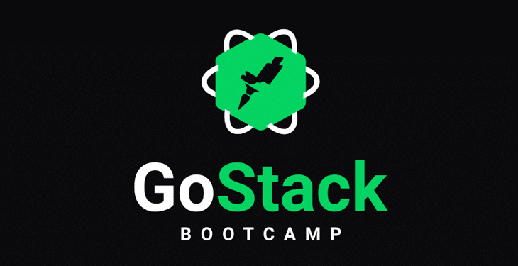

# :rocket: GoStack - Challenge 02 :rocket:

<h1 align="center">
   
    <br>
    Challange 02
</h1>

### Challenge 📘

This application must store repositories, which will allow the creation, listing, updating and removal of the repositories, and also allow the repositories to receive "likes".

[Desafio Completo](https://github.com/rocketseat-education/bootcamp-gostack-desafios/tree/master/desafio-conceitos-nodejs)

### How to use? 📗

- Download the code or use the ```git clone```
- Navigate to the project root and run ```yarn```
- Now just start testing!

### Credits 👏

- [Rocketseat](https://rocketseat.com.br/)

Made with 💙 by [Pedro](https://www.linkedin.com/in/pedrohenriqueoliveiramartins/)

